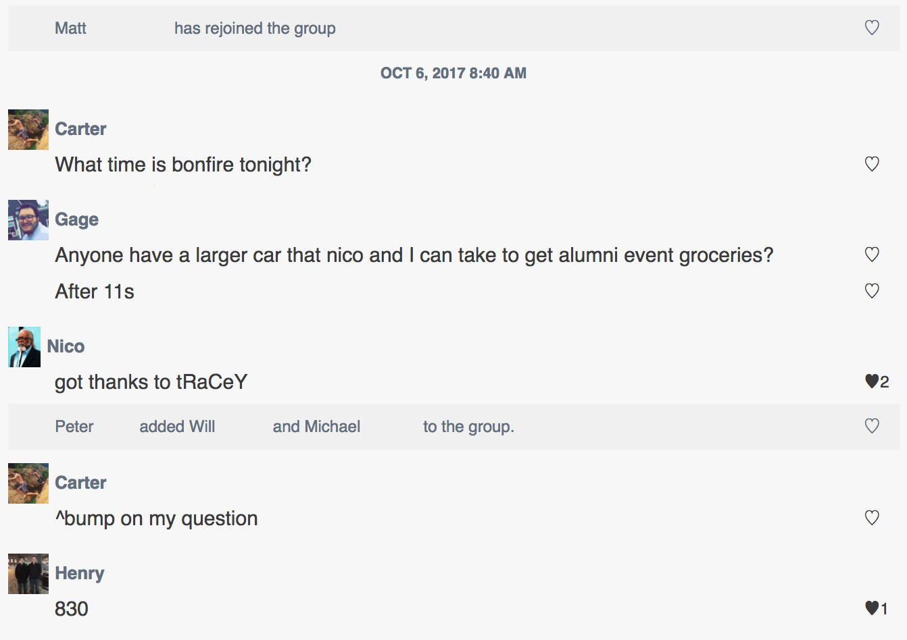

# Groupme Saver
Groupme Saver is an interactive Python script that downloads the full content of a Groupme including attachments.

It saves all of the images and videos locally, along with all of the icons for the members of the group.  Then it writes all of the messages into an HTML file that can be viewed locally in the browser, and appears roughly like the Groupme did.

  

It additionally saves all of the message information into a CSV file if you want a more detailed breakdown compared to the visuals.

## How To Run
To run it, you will need to get your access token.  Go to https://dev.groupme.com and log in, and then in the top menu bar there will be an option for 'Access Token'.  Copy that, and when you run the python script with `python downloadGroupme.py` it will prompt you for the token.  Paste it in, and then type the number of the group you want to download and it will take care of the rest!

---

**Technologies**
* HTML
* CSS
* Python

**APIs**
* GroupMe

**Created by Alex Beals © 2017**
